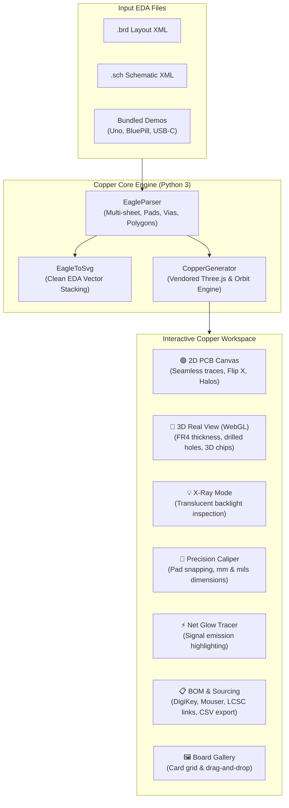

# ⚡ Copper Viewer

[](https://opensource.org/licenses/MIT)
[](https://www.python.org/)
[](https://threejs.org/)
[](https://github.com/fbetancourt-dev/copper-viewer)
[](https://github.com/fbetancourt-dev/copper-viewer)

> **Next-generation Autodesk & CadSoft EAGLE CAD, Gerber and PCB interactive viewer inspired by the famous Copper Touch app for iPad (AppFruits).**

`copper-viewer` combines the precision of engineering CAD tools with the fluidity, visual elegance, and 3D photorealism pioneered by mobile EDA apps. It runs as a zero-dependency standalone CLI tool, generating single-file self-contained HTML visualizers with embedded **Three.js WebGL 3D**, interactive 2D vector inspection, precision calipers, signal emission tracers, and distributor-integrated BOM tables.

---

## 🏛️ Architecture & Pipeline



---

## ✨ Features Inspired by Copper Touch (iPad)

### 1. 🧊 3D Real View (Photorealistic WebGL Rendering)
- **Physical Board Substrate:** Extruded FR4 dielectric core with authentic board thickness (1.6mm), chamfered edges, and mounting holes punched completely through the geometry.
- **Parametric 3D Components:** Automatically generates 3D IC chips (DIP with pin-1 notch, SOIC/TSSOP with gull-wing leads, QFP with lead frames), passive SMD chips (0402, 0603, 0805, 1206 with ceramic body and silver solder end-caps), pin headers with gold-plated square pins, aluminum electrolytic capacitor cans, and crystal oscillators.
- **Solder Mask Palette:** Switch solder mask finishes in real-time between **JLCPCB Green**, **OSHPark Purple**, **Matte Black**, **Royal Blue**, **Crimson Red**, and **Arctic White**.
- **Surface Finishes:** Configurable **ENIG Gold** and **HASL Silver** metallic reflectivity.
- **Studio Lighting & Shadows:** 3-point key/fill/rim illumination with soft shadow maps and 360° orbit damping.

### 2. 💡 X-Ray Mode (Mesa de Luz)
- Optical transillumination mode simulating an inspection backlight table.
- Renders the PCB substrate semi-translucent, revealing both Top and Bottom copper tracks, inner alignments, and vias simultaneously without losing spatial orientation.

### 3. 📏 Precision Caliper (Magnetic Snapping Ruler)
- Click point A and point B on the PCB: automatically snaps to the exact center of pads, vias, mounting holes, and board corners within an 8px radius.
- Displays high-contrast dimension callout showing Euclidean distance in **millimeters** (`mm`) and thousandths of an inch (**mils**), plus \(\Delta X\) and \(\Delta Y\).

### 4. ⚡ Net Glow Tracer (Emission Highlighter)
- Clicking any track, pad, or pin detects the connected signal net across all layers.
- Applies an animated, pulsating cyan/neon glow filter along every copper segment and via of that net (`emissionTextureForSignal`), making complex trace routing instantly obvious.

### 5. 📋 Sourcing & Enriched BOM Table
- Aggregated Bill of Materials grouped by value and package.
- Direct quick-search links to electronics distributors: **DigiKey**, **Mouser**, and **LCSC**.
- One-click export to `circuit_BOM.csv`.

### 6. 🖼️ Board Gallery & Multi-Sheet Navigation
- Dashboard view displaying project cards with dimensions, layer count, component count, and signal count.
- Full support for multi-sheet schematics with seamless sheet switching and cross-probing.

---

## 📥 Installation

### Global User Executable (Recommended)
Clone the repository and link the binary to your local PATH:
```bash
git clone https://github.com/fbetancourt-dev/copper-viewer.git
cd copper-viewer
ln -sf $(pwd)/copper_viewer/cli.py ~/.local/bin/copper-viewer
chmod +x ~/.local/bin/copper-viewer
```

### Editable Pip Installation
```bash
cd copper-viewer
pip install -e .
```

Verify the installation:
```bash
copper-viewer --version
```

---

## 🚀 Usage

### 1. View Any EAGLE Circuit
```bash
# Open interactive viewer for board and schematic:
copper-viewer my_board.brd my_schematic.sch

# Auto-discover companion file (.sch or .brd in the same folder):
copper-viewer my_board.brd
```

### 2. Explore Bundled Hardware Reference Designs
`copper-viewer` includes reference hardware designs out of the box:
```bash
# Arduino Uno Rev3 (ATmega328P DIP):
copper-viewer --sample uno

# STM32 BluePill (Cortex-M3 F103):
copper-viewer --sample bluepill

# USB-C 100W PD GaN Fast Charger:
copper-viewer --sample usbc
```

### 3. Silent Batch Generation & CI Automation
```bash
# Generate self-contained standalone HTML without launching a browser:
copper-viewer my_board.brd --no-open -o /var/www/html/circuit.html

# Export vector SVGs (Schematic, Top layer, Bottom layer, Combined board):
copper-viewer my_board.brd --export-svg ./svg_docs/ --no-open

# Dump topology JSON to stdout for UNIX pipelines (jq / grep):
copper-viewer my_board.brd --json-only | jq '.board.bounds'
```

---

## ⌨️ Keyboard Shortcuts & Gestures

| Key / Action | Function |
| :--- | :--- |
| `Left Click + Drag` | Pan 2D Canvas / Rotate 3D Board Orbit |
| `Scroll Wheel` | Smooth Zoom Centered at Cursor |
| `F` | Voltear / Flip X (Physical PCB back-side inspection) |
| `Top` / `Bottom` / `Both` | Instant Layer Isolation Presets |
| `Click on Pad / Track` | Trigger Net Glow Tracer & Component Cross-Probing |
| `Caliper Mode` | Click Point A and Point B to measure distance with snapping |

---

## 📄 License

Distributed under the **MIT License**. Created by Francisco Betancourt & Antigravity (Sam).
Inspiration and reverse-engineering architectural patterns credited to **Copper Touch (AppFruits)**.
